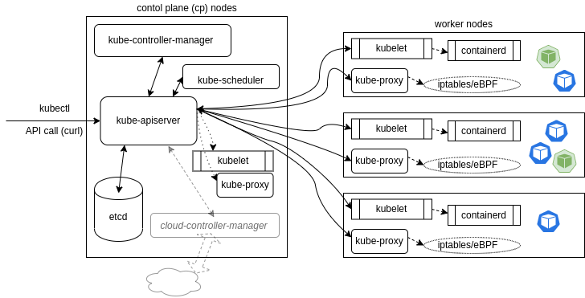

# Introduction to Kubernetes (K8s)

## What is Kubernetes?

Kubernetes is an open-source software for automating the deployment, scaling, and management of containerized applications.

---

## A Brief History of Kubernetes

- Kubernetes originated as part of **Google Cloud Platform's Project Borg**, which was designed to manage large-scale containerized workloads.
- The name "Kubernetes" comes from the Greek word **"κυβερνήτης"**, meaning **"helmsman"**.
- The abbreviation **"K8s"** represents "Kubernetes" with the middle 8 characters omitted (K + 8 letters + s).
- Kubernetes is often pronounced as "**Kates**."

---

## Why Kubernetes Matters?

Kubernetes simplifies the management of containerized applications by:
- Automating scaling and deployment.
- Providing self-healing capabilities.
- Offering a unified platform for running applications across hybrid or multi-cloud environments.

A Kubernetes cluster is composed of **Control Plane nodes (CP)** and **Worker nodes**.  
All Kubernetes nodes run two core components:
- **`kubelet`**: Manages the container runtime engine (e.g., CRI-O, containerd).
- **`kube-proxy`**: Manages networking for containers and controls external communication.

---

### Control Plane (CP)

The Control Plane is responsible for managing the Worker nodes and the overall state of the cluster. It provides:
- **API Server**: Handles communication between components and exposes the Kubernetes API.
- **Scheduler**: Allocates resources to pods and manages workload distribution.
- **Cluster Store**: Stores configuration and state information, typically using etcd.
- **Network Settings**: Manages cluster-wide networking.

> Note: The Control Plane typically does not run application containers.

### Worker nodes 

Worker nodes are the machines where application containers are deployed and run. Their operating system can be either **Linux** or **Windows Server**, depending on the environment and requirements.

Each node can run different container runtime engines, such as:
- **CRI-O**
- **Containerd**

These engines are managed by the `kubelet` component, which ensures that containers are running as defined in the Kubernetes specifications.

For more information about Windows containers in Kubernetes, refer to the [official Kubernetes documentation on Windows](https://kubernetes.io/docs/concepts/windows/intro/).
